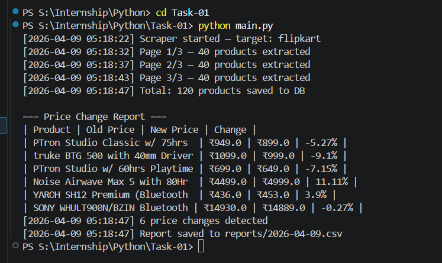
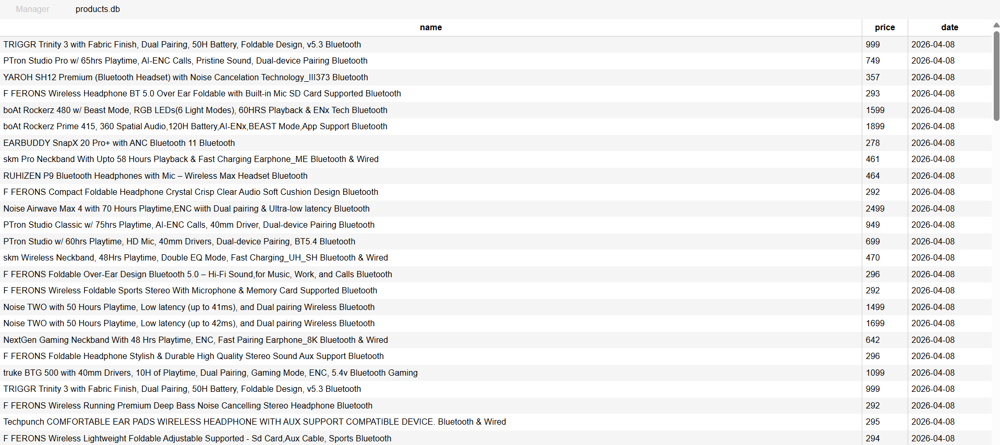

# 🛒 Dynamic Web Scraper with Price Tracking

## 📌 Objective

Build a scraper to extract structured data from JavaScript-rendered e-commerce websites, store daily snapshots, and detect price changes over time.

---

## ⚙️ Tech Stack

* Python
* Playwright (for dynamic scraping)
* SQLite (data storage)
* CSV (report generation)
* Schedule (task automation)

---

## 🚀 Features Implemented

### ✅ Dynamic Web Scraping

* Used Playwright to scrape JavaScript-rendered content from Flipkart
* Extracted product name and price using stable selectors:

  * `a[title]` → product name
  * `text=₹` → price

---

### ✅ Pagination

* Iterates through multiple pages (limited to 3 for controlled scraping)
* Logs page-wise extraction

---

### ✅ Rate Limiting & Retry

* Random delay between requests to avoid detection
* Retry mechanism for failed page loads

---

### ✅ Data Storage

* Stores daily product data in SQLite
* Schema:

  * `name`
  * `price`
  * `date`

---

### ✅ Price Comparison

* Compares today's data with previous day
* Detects price increases/decreases
* Ignores unchanged products

---

### ✅ CSV Reporting

* Generates daily report:

  ```
  reports/YYYY-MM-DD.csv
  ```

---

### ✅ Scheduling

* Automated using Python `schedule`
* Runs scraper daily at **2:00 AM**

---

## 📊 Sample Output

```
[2026-02-24 02:00:01] Scraper started — target: flipkart
[2026-02-24 02:00:03] Page 1/3 — 24 products extracted
[2026-02-24 02:00:06] Page 2/3 — 24 products extracted
[2026-02-24 02:00:09] Page 3/3 — 20 products extracted
[2026-02-24 02:00:10] Total: 68 products saved to DB

=== Price Change Report ===
| Product | Old Price | New Price | Change |
| Sony WH-1000XM5 | ₹34800 | ₹27999 | -19.5% |

[2026-02-24 02:00:11] 1 price changes detected
[2026-02-24 02:00:11] Report saved to reports/2026-02-24.csv
```

---

## 🧠 Key Learning

* Dynamic scraping requires browser automation (Playwright)
* Avoid unstable selectors (class names) (specific to flipkart)
* Store historical snapshots for comparison
* Scheduling enables automated data pipelines

---

## ▶️ How to Run

```bash
pip install playwright schedule
playwright install chromium
python main.py       # for single run
python scheduler.py # for scheduled run
``` 

---

## Outputs

# comparison result

---
# scrapped products

---

## ⚠️ Note

* Script must remain running for scheduled execution 
* Alternatively, OS schedulers (Task Scheduler / cron) can be used


