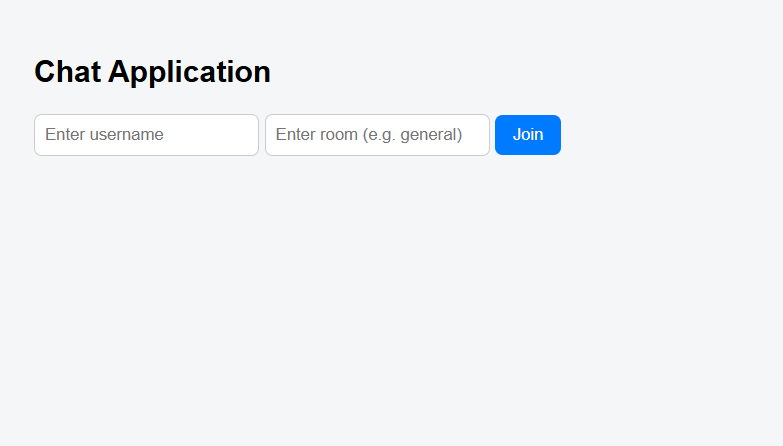
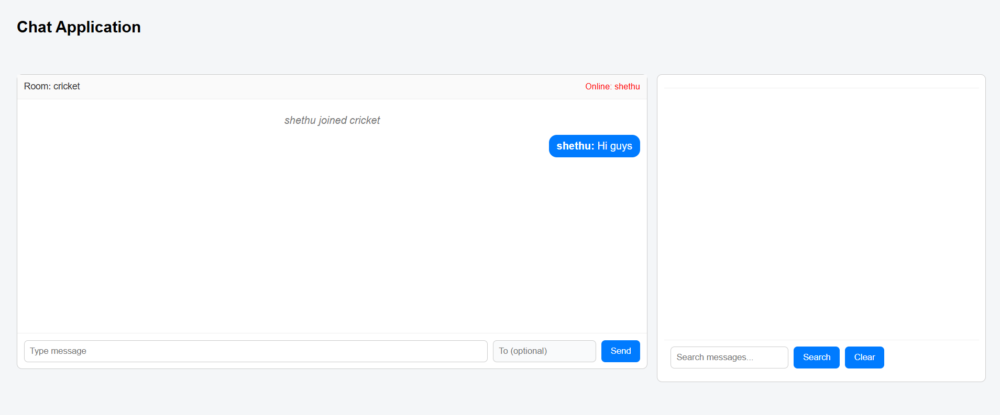
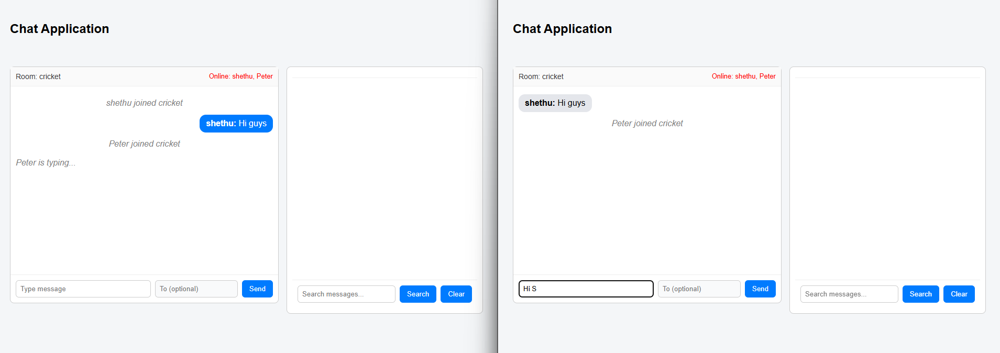
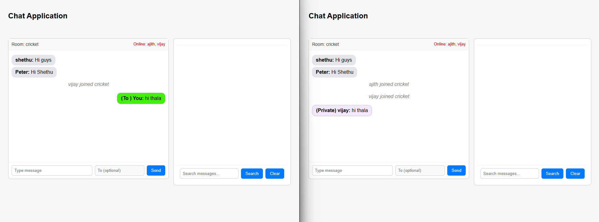

# 💬 Real-Time Chat Application (WebSockets)

## 🎯 Objective

Build a real-time multi-room chat application using WebSockets with support for private messaging, typing indicators, user presence tracking, and message history persistence.

---

## 🚀 Features Implemented

### 🔹 Real-Time Chat
- WebSocket-based communication using FastAPI
- Instant message broadcasting across users

### 🔹 Multi-Room Support
- Users can join named chat rooms
- Messages are isolated per room

### 🔹 Private Messaging
- Direct 1-to-1 messaging between users
- Separate styling for private messages

### 🔹 Typing Indicator
- Shows "user is typing..." in real-time
- Implemented with debouncing to avoid flicker

### 🔹 User Presence
- Displays currently online users in the room
- Updates dynamically on join/leave

### 🔹 Message Persistence
- Messages stored using SQLite
- Chat history loaded on user join

### 🔹 Message Search
- Search messages by keyword
- Results displayed in a separate panel

---

## 🛠️ Tech Stack

- **Backend**: FastAPI (WebSockets)
- **Frontend**: HTML, CSS, JavaScript
- **Database**: SQLite
- **Async Handling**: asyncio

---

## 🧠 Key Concepts

- WebSocket protocol (persistent connection)
- Async programming (`async/await`)
- Event-driven architecture
- State management (rooms, users, sockets)
- Separation of concerns (UI + logic)

---

## 📂 Project Structure
# 💬 Real-Time Chat Application (WebSockets)

## 🎯 Objective

Build a real-time multi-room chat application using WebSockets with support for private messaging, typing indicators, user presence tracking, and message history persistence.

---

## 🚀 Features Implemented

### 🔹 Real-Time Chat
- WebSocket-based communication using FastAPI
- Instant message broadcasting across users

### 🔹 Multi-Room Support
- Users can join named chat rooms
- Messages are isolated per room

### 🔹 Private Messaging
- Direct 1-to-1 messaging between users
- Separate styling for private messages

### 🔹 Typing Indicator
- Shows "user is typing..." in real-time
- Implemented with debouncing to avoid flicker

### 🔹 User Presence
- Displays currently online users in the room
- Updates dynamically on join/leave

### 🔹 Message Persistence
- Messages stored using SQLite
- Chat history loaded on user join

### 🔹 Message Search
- Search messages by keyword
- Results displayed in a separate panel

---

## 🛠️ Tech Stack

- **Backend**: FastAPI (WebSockets)
- **Frontend**: HTML, CSS, JavaScript
- **Database**: SQLite
- **Async Handling**: asyncio

---

## 🧠 Key Concepts

- WebSocket protocol (persistent connection)
- Async programming (`async/await`)
- Event-driven architecture
- State management (rooms, users, sockets)
- Separation of concerns (UI + logic)

---

## 📂 Project Structure
# 💬 Real-Time Chat Application (WebSockets)

## 🎯 Objective

Build a real-time multi-room chat application using WebSockets with support for private messaging, typing indicators, user presence tracking, and message history persistence.

---

## 🚀 Features Implemented

### 🔹 Real-Time Chat
- WebSocket-based communication using FastAPI
- Instant message broadcasting across users

### 🔹 Multi-Room Support
- Users can join named chat rooms
- Messages are isolated per room

### 🔹 Private Messaging
- Direct 1-to-1 messaging between users
- Separate styling for private messages

### 🔹 Typing Indicator
- Shows "user is typing..." in real-time
- Implemented with debouncing to avoid flicker

### 🔹 User Presence
- Displays currently online users in the room
- Updates dynamically on join/leave

### 🔹 Message Persistence
- Messages stored using SQLite
- Chat history loaded on user join

### 🔹 Message Search
- Search messages by keyword
- Results displayed in a separate panel

---

## 🛠️ Tech Stack

- **Backend**: FastAPI (WebSockets)
- **Frontend**: HTML, CSS, JavaScript
- **Database**: SQLite
- **Async Handling**: asyncio

---

## Output

## Entry screen

---
## Chat screen

---
## Typing indicator

---
## Private Messaging


---

## 🧠 Key Concepts

- WebSocket protocol (persistent connection)
- Async programming (`async/await`)
- Event-driven architecture
- State management (rooms, users, sockets)
- Separation of concerns (UI + logic)

---

## 🧪 How to Run

```bash
uvicorn main:app --reload
