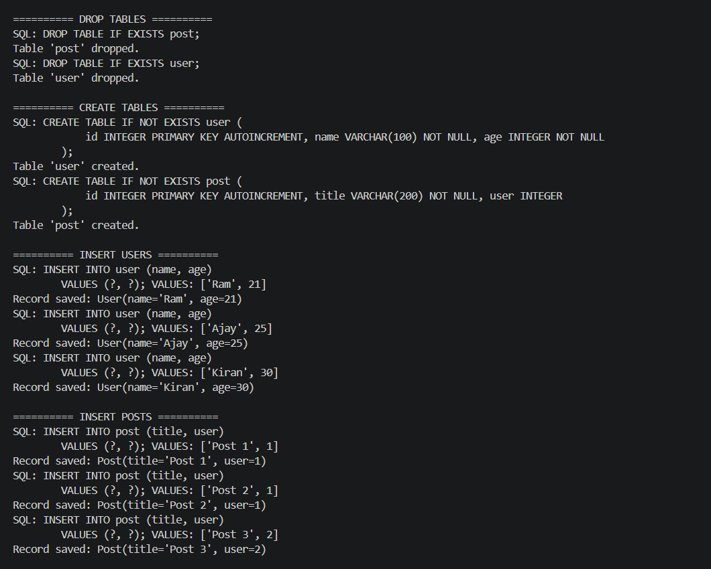
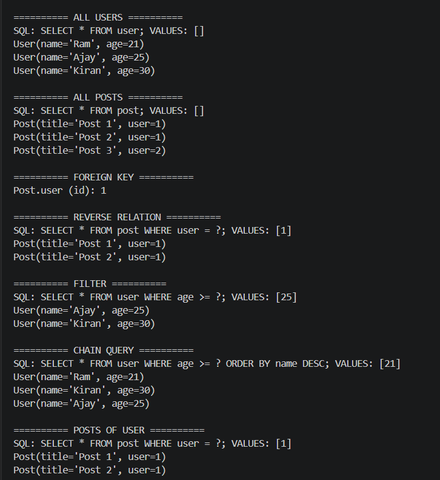
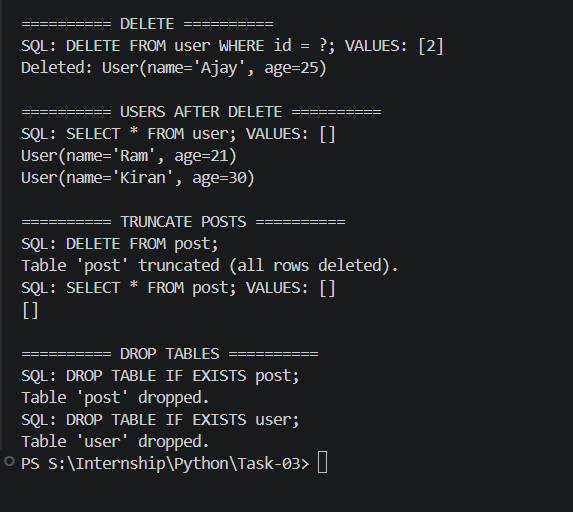

# 🧩 Lightweight ORM System (Python)

## 🎯 Objective

Build a lightweight Object Relational Mapper (ORM) from scratch using core Python concepts to enable database interaction through Python classes instead of writing raw SQL queries.

---

## 🚀 Features Implemented

### 🔹 Model-Based Table Design

* Define database tables using Python classes
* Fields mapped to database columns automatically

### 🔹 Automatic Table Creation

* Generates SQL CREATE TABLE statements from model definitions
* Supports primary key (id) and field constraints

### 🔹 Field Validation

* Enforces type and constraint validation using descriptors
* Supports CharField, IntegerField, and ForeignKey

### 🔹 CRUD Operations

* Insert records using .save()
* Delete records using .delete()
* Fetch all records using .all()

### 🔹 Dynamic Query Builder

* Supports filtering using conditions like greater than, less than, etc.
* Converts Python-style queries into SQL dynamically

### 🔹 Method Chaining

* Chain multiple query operations fluently
* Enables clean and readable query construction

### 🔹 Foreign Key Relationships

* Supports relationships between models
* Stores references using IDs

### 🔹 Reverse Relationship Access

* Automatically provides reverse access (e.g., user → posts)
* No manual relationship definition required

### 🔹 Lazy Loading

* Related data is fetched only when accessed
* Avoids unnecessary database queries

---

## 🛠️ Tech Stack

* Language: Python
* Database: SQLite
* Core Concepts: Metaclasses, Descriptors, SQL

---

## Output

---

---

---

## 🧠 Key Concepts

* Metaclasses for dynamic class processing
* Descriptor protocol for attribute control and validation
* Query building and SQL generation
* Lazy loading vs eager loading
* Method chaining pattern
* Object-to-database mapping

---

## 🧪 How to Run

Run the main script to test all ORM functionalities including table creation, data insertion, querying, and relationships.

---

## 🏁 Conclusion

This project demonstrates how ORM systems internally bridge object-oriented programming with relational databases. It provides a strong foundation in Python internals and database abstraction, closely resembling the working principles of frameworks like Django ORM and SQLAlchemy.
