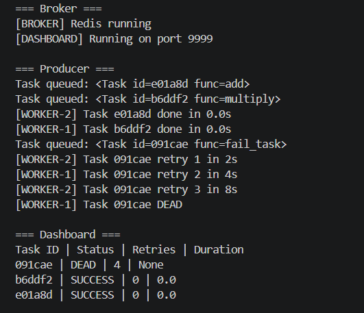

# 🚀 Distributed Task Queue System (Producer–Consumer)

## 📌 Objective

To design and implement a **distributed task queue system** that:

* Executes tasks asynchronously
* Distributes workload across multiple worker processes
* Handles failures with retry logic using exponential backoff
* Stores results for monitoring and retrieval
* Provides a dashboard to visualize task execution

---

## 🏗️ Architecture Overview

### 🔁 Workflow

Producer → Redis Queue → Worker →
→ Success → Result Backend
→ Failure → Retry Queue → Worker
→ Max retries → Dead Queue

---

## ⚙️ Tech Stack

* **Python**

  * multiprocessing (parallel workers)
  * threading (background services)
* **Redis**

  * message broker
  * retry scheduler (sorted set)
  * pub/sub events
* **Serialization**

  * pickle (task transfer)
  * json (result storage)
* **Socket Programming**

  * dashboard communication

---

## 🧩 System Components

### 1. Producer (`main.py`)

* Creates and enqueues tasks
* Serializes tasks using pickle

---

### 2. Broker (`redis_queue.py`)

* Manages:

  * Main queue
  * Retry queue (sorted set)
  * Dead-letter queue
* Uses Redis commands:

  * LPUSH / BRPOP
  * ZADD / ZRANGEBYSCORE

---

### 3. Worker (`worker.py`)

* Runs in multiple processes
* Executes tasks
* Handles:

  * Success → store result
  * Failure → retry or dead queue

---

### 4. Task Model (`task.py`)

* Encapsulates:

  * Function
  * Arguments
  * Retry count
* Supports serialization/deserialization

---

### 5. Backend (`backend.py`)

* Stores results in Redis
* Key format:

  ```
  result:<task_id>
  ```

---

### 6. Dashboard (`dashboard.py`)

* Socket server (port 9999)
* Displays:

  * Task ID
  * Status
  * Retries
  * Execution time

---

## 🔁 Retry Mechanism

* On failure:

  ```
  retries += 1
  delay = 2^retries
  ```
* Task moved to retry queue with future timestamp
* Scheduler moves it back when ready

---

## ⚠️ Dead Letter Queue

* If retries exceed limit:

  * Task moved to `queue:dead`
* Prevents infinite retry loops

---

## 🧠 Core Concepts Implemented

### 🔹 Multiprocessing

* Multiple worker processes
* Enables true parallel execution

---

### 🔹 Multithreading

* Dashboard thread (socket server)
* Retry scheduler thread
* Non-blocking background execution

---

### 🔹 Serialization (pickle)

* Converts task object → bytes
* Required for inter-process communication

---

### 🔹 Redis Data Structures

| Structure  | Use                 |
| ---------- | ------------------- |
| List       | Main queue          |
| Sorted Set | Retry scheduling    |
| String     | Result storage      |
| Pub/Sub    | Event notifications |

---

### 🔹 Pub/Sub Events

Used for:

* Logging
* Real-time monitoring (future scope)

Examples:

```
QUEUED:<task_id>
SUCCESS:<task_id>
RETRY:<task_id>:<count>
DEAD:<task_id>
```

---

## 🔄 Communication Model

* Processes → communicate via Redis
* Threads → share memory within process
* Redis → acts as central communication hub

---

## ▶️ How to Run

### 1. Start Redis

```bash
redis-server
```

---

### 2. Run the system

```bash
python main.py
```

---

### 3. View Dashboard

* Output is printed automatically
* Uses socket connection on port `9999`

---

## 📌 Sample Tasks

```python
enqueue(add, 2, 3)
enqueue(multiply, 4, 5)
enqueue(fail_task, 10)
```

---

## 📊 Output (Sample)




---


