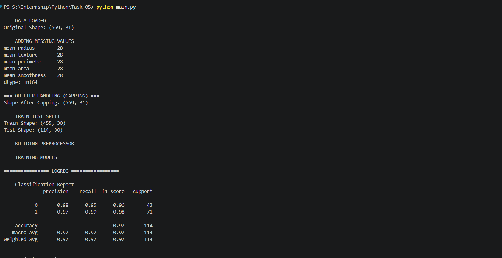
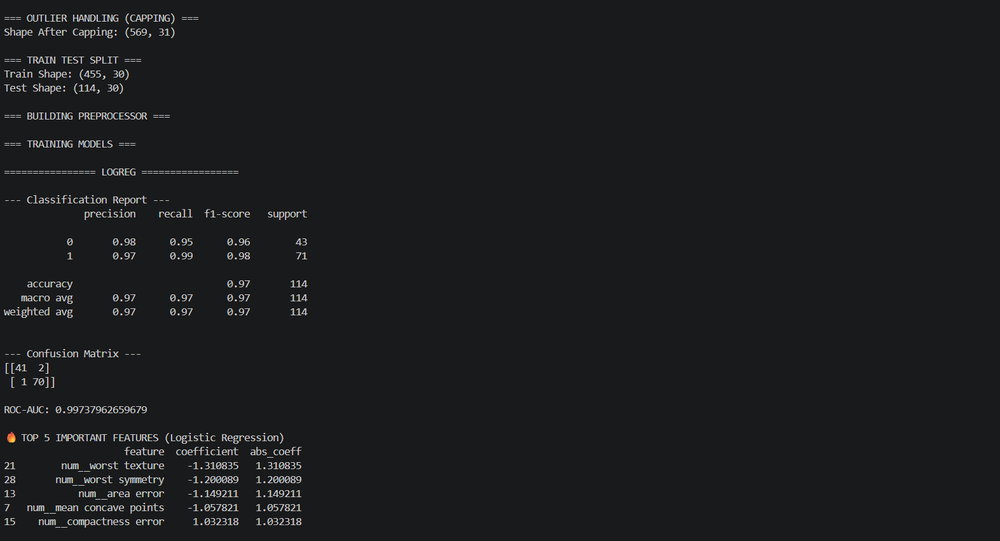
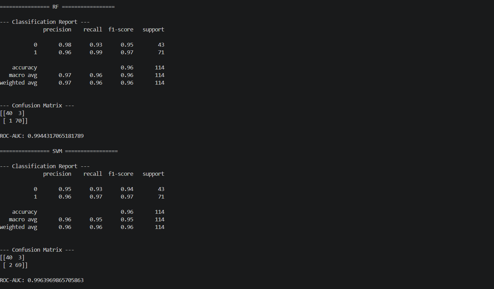
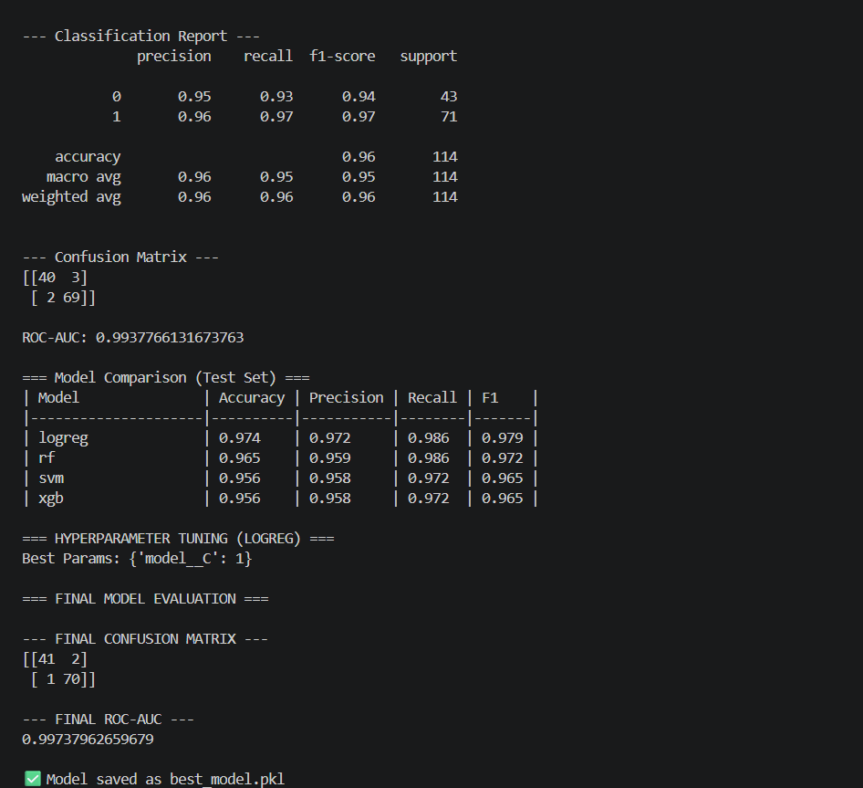

# 🚀 End-to-End Machine Learning Pipeline

## 📌 Objective

Build a complete ML pipeline that ingests raw data, handles missing values and outliers, performs preprocessing, trains multiple models, evaluates performance, and saves the best model.

---

## 🛠️ Tech Stack

* Python
* Pandas, NumPy
* Scikit-learn (Pipeline, Model Selection, Metrics)
* XGBoost
* Matplotlib
* Joblib

---

## 📂 Project Structure

```
project/
│── src/
│   ├── data_loader.py
│   ├── preprocessing.py
│   ├── outlier.py
│   ├── models.py
│   ├── tuning.py
│   ├── evaluate.py
│   ├── visualization.py
│   └── feature_importance.py
│
│── main.py
│── README.md
```

---

## ⚙️ Pipeline Overview

### 1️⃣ Data Ingestion

* Loaded dataset using modular `load_data()` function
* Initial shape logged for verification

---

### 2️⃣ Missing Value Handling

* Artificial missing values introduced (for robustness testing)
* Handled using:

  * **Median imputation** for numeric features
  * **Most frequent imputation** for categorical features

---

### 3️⃣ Outlier Handling (Capping)

* Used **IQR-based capping (winsorization)**
* Extreme values clipped instead of removing rows

✅ Benefits:

* Prevents data loss
* Improves model stability

---

### 4️⃣ Train-Test Split

* Data split into training and testing sets
* Ensures unbiased evaluation

---

### 5️⃣ Preprocessing Pipeline

Implemented using `ColumnTransformer`:

* Numeric:

  * Imputation (median)
  * Standard Scaling
* Categorical:

  * Imputation (mode)
  * One-hot encoding

---

### 6️⃣ Model Training & Evaluation

Trained multiple models:

* Logistic Regression
* Random Forest
* Support Vector Machine (SVM)
* XGBoost

Each model:

* Trained using pipeline
* Evaluated on test data
* Metrics computed:

  * Accuracy
  * Precision
  * Recall
  * F1 Score
  * ROC-AUC

---


### 7️⃣ Hyperparameter Tuning

* Applied **GridSearchCV** on Logistic Regression
* Optimized parameter:

  * `C` (regularization strength)

---

### 8️⃣ Final Evaluation

* Evaluated tuned model on test set
* Metrics:

  * Classification Report
  * Confusion Matrix
  * ROC-AUC

---

### 9️⃣ Feature Importance

* Extracted using model coefficients (Logistic Regression)
* Displayed top contributing features

---

### 🔟 Model Saving

* Final model saved using `joblib`
---

### Output


---

---

---

---
